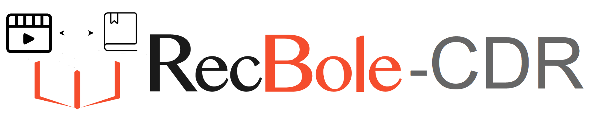
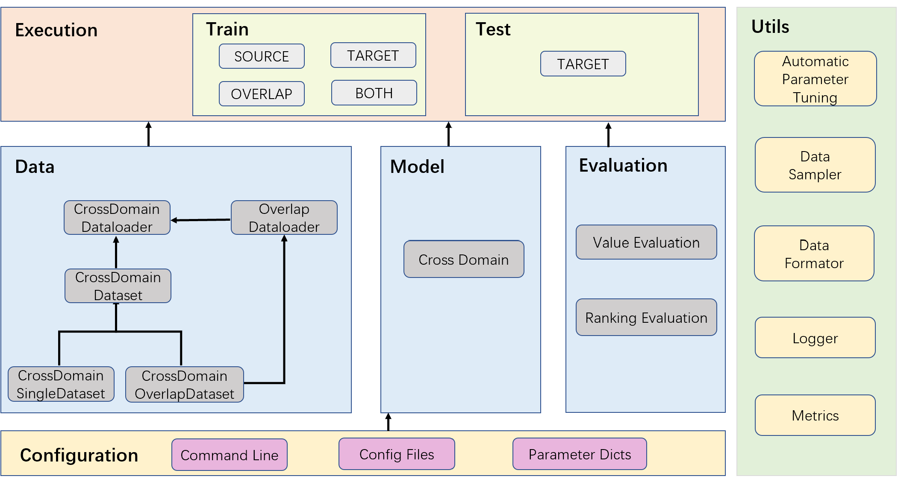

--------------------------------------------------------------------------------

# RecBole-CDR

[](./LICENSE)


[English Version]


[English Version]: README.md


RecBole-CDR 是一个基于 [RecBole](https://github.com/RUCAIBox/RecBole) 的代码库，其针对跨领域推荐算法。




## 特色

* **面向跨域推荐的高度兼容的自动化数据处理**：
    我们设计了一种通用且可扩展的数据结构来支持跨域推荐任务，其继承了所有RecBole支持的数据处理方式，并且能够自动对域间的重叠数据进行匹配。

* **灵活且可定制化的训练模式**：
    我们提供了适用于跨域推荐的四种基础训练模式，其支持进行自由的组合使用，并方便针对特殊的训练方式进行定制化。

* **丰富的跨域推荐算法**：
    基于统一的数据结构和灵活的训练模式，我们的工具包实现了丰富的跨域推荐算法并进行了算法间的标准标准。

## 前提

```
recbole==1.0.0
torch>=1.7.0
python>=3.7.0
```

## 快速上手
如果你从 GitHub 下载了 RecBole-CDR 的源码，你可以使用提供的脚本进行简单的使用：

```bash
python run_recbole_cdr.py
```

这个例子将会以 ml-1m 为源域数据集，以 ml-100k 为目标域数据集运行 CMF 模型的训练和测试。

如果你想要改变运行模型，只需要在执行脚本时添加额外的设置参数即可：

```bash
python run_recbole_cdr.py --model=[model]
```

## 已实现的模型

下面列出了目前我们支持的跨域推荐模型：

* **[CMF](recbole_cdr/model/cross_domain_recommender/cmf.py)** from Singh *et al.*: [Relational Learning via Collective Matrix Factorization](https://dl.acm.org/doi/10.1145/1401890.1401969) (SIGKDD 2008).
* **[DTCDR](recbole_cdr/model/cross_domain_recommender/dtcdr.py)** from Zhu *et al.*: [DTCDR: A Framework for Dual-Target Cross-Domain Recommendation](https://dl.acm.org/doi/10.1145/3357384.3357992) (CIKM 2019).
* **[CoNet](recbole_cdr/model/cross_domain_recommender/conet.py)** from Hu *et al.*: [CoNet: Collaborative Cross Networks for Cross-Domain Recommendation](http://dl.acm.org/doi/10.1145/3269206.3271684) (CIKM 2018).
* **[BiTGCF](recbole_cdr/model/cross_domain_recommender/bitgcf.py)** from Liu *et al.*: [Cross Domain Recommendation via Bi-directional Transfer Graph Collaborative Filtering Networks](https://dl.acm.org/doi/10.1145/3340531.3412012) (CIKM 2020).
* **[CLFM](recbole_cdr/model/cross_domain_recommender/clfm.py)** from Gao *et al.*: [Cross-Domain Recommendation via Cluster-Level Latent Factor Model](http://www.ecmlpkdd2013.org/wp-content/uploads/2013/07/417.pdf) (PKDD 2013).
* **[DeepAPF](recbole_cdr/model/cross_domain_recommender/deepapf.py)** from Yan *et al.*: [DeepAPF: Deep Attentive Probabilistic Factorization for Multi-site Video Recommendation](https://www.ijcai.org/proceedings/2019/0202.pdf) (IJCAI 2019).
* **[NATR](recbole_cdr/model/cross_domain_recommender/natr.py)** from Gao *et al.*: [Cross-domain Recommendation Without Sharing User-relevant Data](https://dl.acm.org/doi/10.1145/3308558.3313538) (WWW 2019).
* **[EMCDR](recbole_cdr/model/cross_domain_recommender/emcdr.py)** from Man *et al.*: [Cross-Domain Recommendation: An Embedding and Mapping Approach](https://www.ijcai.org/proceedings/2017/343) (IJCAI 2017).
* **[SSCDR](recbole_cdr/model/cross_domain_recommender/sscdr.py)** from Kang *et al.*: [Semi-Supervised Learning for Cross-Domain Recommendation to Cold-Start Users](http://dl.acm.org/doi/10.1145/3357384.3357914) (CIKM 2019).
* **[DCDCSR](recbole_cdr/model/cross_domain_recommender/dcdcsr.py)** from Zhu *et al.*: [A Deep Framework for Cross-Domain and Cross-System Recommendations](https://arxiv.org/abs/2009.06215) (IJCAI 2018).


## 结果
### 数据集

我们搜集并整理了在跨域推荐中常用的三对源域-目标域数据集。我们在这里提供这些数据集以供参考：
- [`Amazon`](https://recbole.s3-accelerate.amazonaws.com/CrossDomain/Amazon.zip) 数据集;
- [`Book-Crossing`](https://recbole.s3-accelerate.amazonaws.com/CrossDomain/Book.zip) 数据集;
- [`Douban`](https://recbole.s3-accelerate.amazonaws.com/CrossDomain/Douban.zip) 数据集;

### 超参数

我们对实现的模型在这些数据集上进行了仔细的调参，并提供我们的结果以供参考：

- [`Amazon`](results/Amazon.md)数据集上的跨域推荐结果；
- [`Book-Crossing`](results/Book-Crossing.md)数据集上的推荐结果；
- [`Douban`](results/Douban.md)数据集上的推荐结果；


## 贡献

如果您遇到错误或有任何建议，请通过 [Issue](https://github.com/RUCAIBox/RecBole-CDR/issues) 进行反馈

我们欢迎关于修复错误、添加新特性的任何贡献。

如果想贡献代码，请先在issue中提出问题，然后再提PR。


## 开发团队

RecBole-CDR由来自[RUCAIBox](http://aibox.ruc.edu.cn/)的成员开发和维护，主要的开发者是林子涵 ([@linzihan-backforward](https://github.com/linzihan-backforward)), 张高玮 ([@Wicknight](https://github.com/Wicknight)), 牟善磊 ([@ShanleiMu](https://github.com/ShanleiMu)).


## 引用

该代码库是基于开源代码库[RecBole](https://github.com/RUCAIBox/RecBole)开发实现的。

如果您使用我们的代码或处理好的数据集，请引用下面的文章。

```
@inproceedings{zhao2021recbole,
  title={Recbole: Towards a unified, comprehensive and efficient framework for recommendation algorithms},
  author={Wayne Xin Zhao and Shanlei Mu and Yupeng Hou and Zihan Lin and Kaiyuan Li and Yushuo Chen and Yujie Lu and Hui Wang and Changxin Tian and Xingyu Pan and Yingqian Min and Zhichao Feng and Xinyan Fan and Xu Chen and Pengfei Wang and Wendi Ji and Yaliang Li and Xiaoling Wang and Ji-Rong Wen},
  booktitle={{CIKM}},
  year={2021}
}
